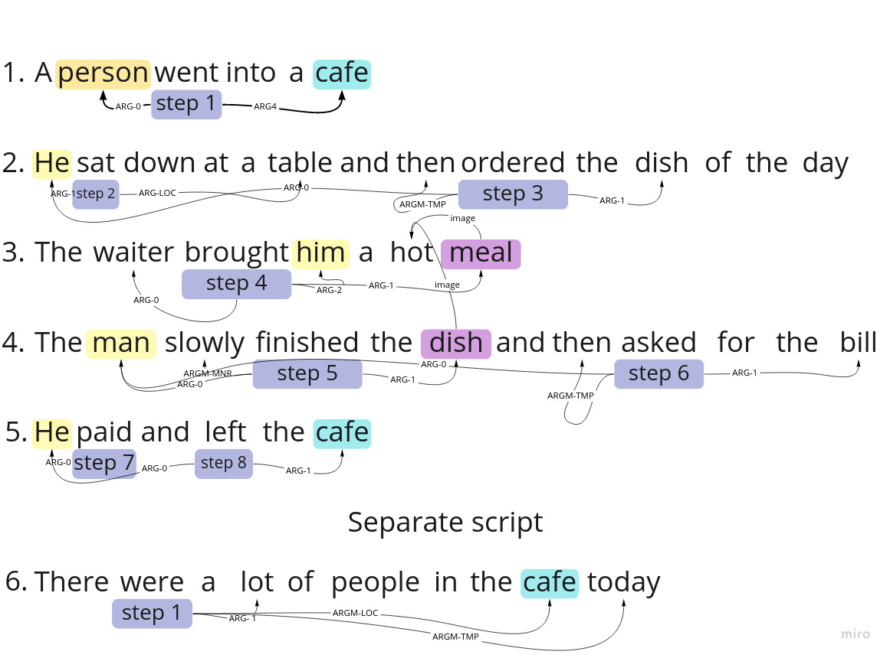
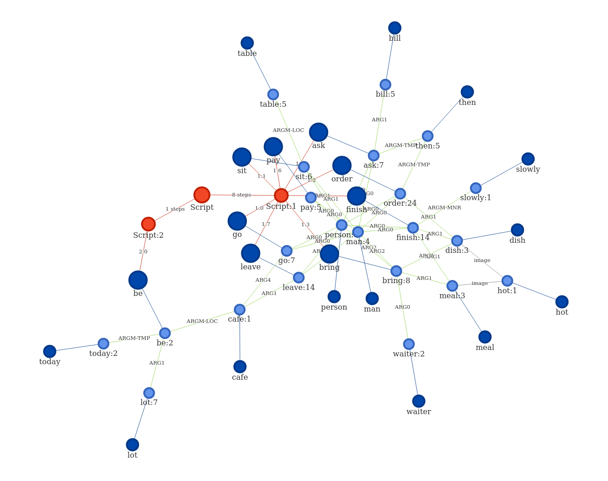

<h1 align="center">Hi there, I'm <a href="https://vk.com/yesssense" target="_blank">Alexandr Korchemnyj</a> 
</h1>
<h3 align="center">Artificial Intelligence science student, Research Engineer from Russia 🇷🇺</h3>

# Research Projects

## Symbolic disentangled representations in hyperdimensional latent space

### Published as a conference paper at ICLR 2023

[ [`Paper`](https://airi.net/ru/articles/symbolic-disentangled-representations-in-hyperdimensional-latent-space/) ] [ [`Repo`](https://github.com/Yessense/paired_codebook_ae) ]

The idea of the disentangled representations is to reduce the data to a set of generative
factors which generate it. Usually, such representations are vectors in the
latent space, in which each coordinate corresponds to one of the generative factors. Then
the object represented in this way can be modified by changing the
value of a specific coordinate. But first, we need to determine which coordinate
handles the desired generative factor, which can be complex with a high vector dimension.
In this paper, we propose to represent each generative factor as a vector
of the same dimension as the resulting representation. This is possible by using
Hyperdimensional Computing principles (also known as Vector Symbolic Architectures), which
represent symbols as high-dimensional vectors. They allow us
to operate on symbols using vector operations, which leads to a simple and interpretable
modification of the object in the latent space. We show it on the objects
from dSprites and CLEVR datasets and provide an extensive analysis of learned
symbolic disentangled representations in hyperdimensional latent space.

## Evaluation of Pretrained Large Language Models in Embodied Planning Tasks

### Published as a conference paper at AGI 2023

[ [`Paper`](https://link.springer.com/chapter/10.1007/978-3-031-33469-6_23) ] [ [`Repo`](https://github.com/Yessense/llm_planning) ]

Modern pretrained large language models (LLMs) are increasingly being used in zero-shot or
few-shot learning modes. Recent years have seen increased interest in applying such models
to embodied artificial intelligence and robotics tasks. When given in a natural language,
the agent needs to build a plan based on this prompt. The best solutions use LLMs through
APIs or models that are not publicly available, making it difficult to reproduce the
results. In this paper, we use publicly available LLMs to build a plan for an embodied
agent and evaluate them in three modes of operation: 1) the subtask evaluation mode, 2)
the full autoregressive plan generation, and 3) the step-by-step autoregressive plan
generation. We used two prompt settings: prompt-containing examples of one given task and
a mixed prompt with examples of different tasks. Through extensive experiments, we have
shown that the subtask evaluation mode, in most cases, outperforms others with a
task-specific prompt, whereas the step-by-step autoregressive plan generation posts better
performance in the mixed prompt setting.

## Neural Robot

We read brain activity using the Emotiv Epoc+ headset. Then we classify into 5 classes:
forward, backward, left, right,
neutral. The output of the model is the control signal for the robot.

My contribution to the project was the idea, project management, the selection and
implementation of the classifier on
pytorch, data collection, model training, the demonstration of the project at the open
house.

*Controlling the robot with eeg signals*

## Neural Jedi

[ [`Repo`](https://github.com/RTUITLab/NeuralJedi)]

In this game you can feel like a real Jedi (provided you have a neuro-headset...) By
reading brain signals, the
neuro-headset recognizes whether you are tense now or not. From there you can interact
with the game space through
tension: make objects fly up in the air, draw a lightsaber, or release destructive
lightning from your hand!

My contribution to the project was the idea, project management, data collection, model
training.

*Screenshot from the game*

# Script-Extracting

[ [`Repo`](https://github.com/Yessense/map-script) ]

Extracting scripts from text and their vector-symbol representation. This work is my
graduation project.

                         Sample text                          |  Script visualization

:------------------------------------------------------------:|:-------------------------:
 |  
