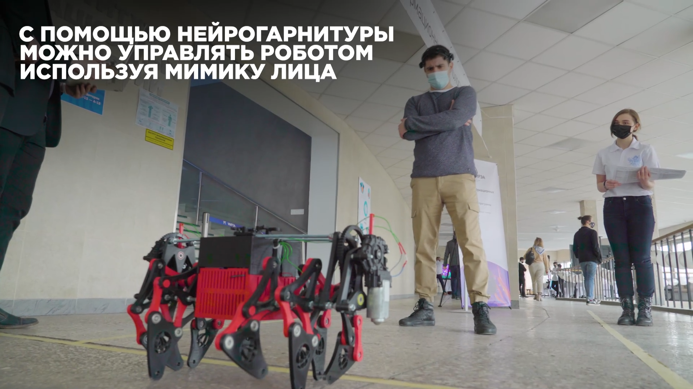
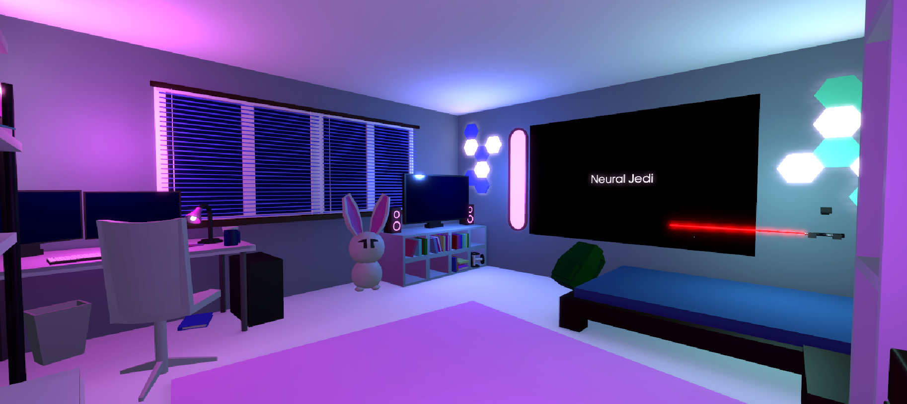

<h1 align="center">Hi there, I'm <a href="https://vk.com/yesssense" target="_blank">Alexandr Korchemnyj</a> 
</h1>
<h3 align="center">Computer science student, Intern Research Engineer from Russia 🇷🇺</h3>

# Projects

## Neural Robot

We read brain activity using the Emotiv Epoc+ headset. Then we classify into 5 classes: forward, backward, left, right,
neutral. The output of the model is the control signal for the robot.

My contribution to the project was the idea, project management, the selection and implementation of the classifier on
pytorch, data collection, model training, the demonstration of the project at the open house.

*Controlling the robot with eeg signals*

## Neural Jedi

In this game you can feel like a real Jedi (provided you have a neuro-headset...) By reading brain signals, the
neuro-headset recognizes whether you are tense now or not. From there you can interact with the game space through
tension: make objects fly up in the air, draw a lightsaber, or release destructive lightning from your hand!

My contribution to the project was the idea, project management, data collection, model training.

*Screenshot from the game*
